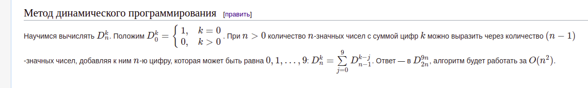

В данной задаче будут рассматриваться 13-ти значные числа в тринадцатиричной
системе исчисления(цифры 0,1,2,3,4,5,6,7,8,9,A,B,C) с ведущими нулями.
Например, ABA98859978C0, 6789110551234, 0000007000000

Назовем число красивым, если сумма его первых шести цифр равна сумме шести
последних цифр.

Пример:

* Число 0055237050A00 - красивое, так как 0+0+5+5+2+3 = 0+5+0+A+0+0
* Число 1234AB988BABA - некрасивое, так как 1+2+3+4+A+B != 8+8+B+A+B+A

Задача:
написать программу на С/С++ печатающую в стандартный вывод количество 13-ти
значных красивых чисел с ведущими нулями в тринадцатиричной системе
исчисления.
В качестве решения должен быть предоставлено:

1. ответ - количество таких чисел. Ответ должен быть представлен в десятичной
системе исчисления.

2. исходный код программы.


---


## Попытка раз


В условиях задачи ничего не сказанно про скорость, поэтому будем создавать домен оперируемых объектов с нуля.

В условиях есть цифры и числа:

* Цифры в диапазоне от *0* до *C*
* Числа составлены из цифр

Для них нужны операции:

* Сложение цифр с переносом (потребуется потом)
* Построение числа из цифр
* Сложение числа и цифры (вот тут и нужен перенос)
* Доступ к разрядам (цифрам) числа
* Сравнение чисел на равенство

Внутренний тип цифры взят **unsigned char** в диапазоне от **0** до **12**. Из этого диапазона и будут инстанционироваться цифры. Сериализацию/десериализацию в цифро-буквенное представление для упрощения я не делал (A = 10, B = 11, C = 12), ее всегда потом прикрутить можно.


## Попытка два


Первая попытка провалилась, обсчитать перебором за разумное время невозможно, так что будем осваивать комбинаторику.

И так, для каждой заданной суммы цифр **S** возможно **Nₛ** комбинаций цифр (сами комбинации не интересны, нужно их количество), **N** = **f(S)**.
Число представим как две половинки, половинки составленны из одного множества цифр, следовательно у есть две группы размером **Nₛ** комбинаций цифр, где каждая комбинация цифр дает сумму **S**.
По основной формуле комбинаторики число комбинаций из комбинаций половинок **Kₛ** = **Nₛ** × **Nₛ** для каждой суммы **S**.

Максимальная цифра **C**, множество сумм каждой половинки **[0, С × 6]**, верхнняя граница **M** = **C × 6**. Итого общее число красивых числел равно **K** = **K₁** + **K₂** + ⋯ + **Kₘ** = (**N₁** × **N₁**) + (**N₂** × **N₂**) + ⋯ + (**Nₘ** × **Nₘ**).

Теперь нужно нужно научиться считать число возможножных комбинаций цифр **Nₛ**, сумма которых равна **S** (функция **N** = **f(S)**).

Это число композиций. Композиций с ограничением по количеству цифр и максимальному значению цифры. Как такое считается совсем непонятно, поэтому опять применим брутфорс.

Отладочная сборка:

```
nix-shell:~/learn_discrete_math/nice_numbers13]$ ../build/bin/benchmark_nice_numbers13 
2021-06-17T01:07:50+03:00
Running ../build/bin/benchmark_nice_numbers13
Run on (8 X 4000 MHz CPU s)
CPU Caches:
  L1 Data 32 KiB (x4)
  L1 Instruction 32 KiB (x4)
  L2 Unified 256 KiB (x4)
  L3 Unified 8192 KiB (x1)
Load Average: 0.38, 0.37, 0.47
***WARNING*** CPU scaling is enabled, the benchmark real time measurements may be noisy and will incur extra overhead.
***WARNING*** Library was built as DEBUG. Timings may be affected.
--------------------------------------------------------
Benchmark              Time             CPU   Iterations
--------------------------------------------------------
BM_calcComp_1 2288749082 ns   2288682742 ns            1
BM_calcComp_2 2276701270 ns   2276678209 ns            1
```

~ 2 секунды

Release:

```
[nix-shell:~/learn_discrete_math]$ b/bin/benchmark_nice_numbers13 
2021-06-17T01:19:03+03:00
Running b/bin/benchmark_nice_numbers13
Run on (8 X 4000 MHz CPU s)
CPU Caches:
  L1 Data 32 KiB (x4)
  L1 Instruction 32 KiB (x4)
  L2 Unified 256 KiB (x4)
  L3 Unified 8192 KiB (x1)
Load Average: 0.86, 0.57, 0.52
***WARNING*** CPU scaling is enabled, the benchmark real time measurements may be noisy and will incur extra overhead.
--------------------------------------------------------
Benchmark              Time             CPU   Iterations
--------------------------------------------------------
BM_calcComp_1  103952517 ns    103949022 ns            5
BM_calcComp_2  103169379 ns    103165865 ns            7
```

~ 100 милисекунд

~~Мдя, (~5M * 0.1) / 3600 ~= 138 часов. На многоядерном процессоре конечно уже можно обсчитать, но такое себе...~~

### Update

Неправильно посчитано количество сумм. Должно быть **(C × 6) + 1** = **(12 × 6) + 1** = **73**

Итого ожидаемое время: 73 × 0.1 ~= 7 секунд. Но уже есть *более правильное* решение.


## Попытка два с половиной

Задачка аналогична посдсчету
[счастливых билетиков](https://neerc.ifmo.ru/wiki/index.php?title=%D0%97%D0%B0%D0%B4%D0%B0%D1%87%D0%B0_%D0%BE_%D1%81%D1%87%D0%B0%D1%81%D1%82%D0%BB%D0%B8%D0%B2%D1%8B%D1%85_%D0%B1%D0%B8%D0%BB%D0%B5%D1%82%D0%B0%D1%85).
Разве что цифры у нас в диапазоне от 0 до 12 (верхнее значение переменной **j**).


От туда нам нужен подсчет числа комбинаций цифр для каждой суммы (функция **N** = **f(S)** упомянутая в начале этого текста). Выдержка:



Реализация функции подсчета комбинаций цифр для заданной суммы (цифр всего шесть в половинке, можно не опасаться что рекурсия пробъет стек):

```cpp
std::size_t D(std::size_t n, std::size_t k) {
    if (n == 0) {
        return (k == 0) ? 1 : 0;
    }
    else {
        std::size_t c = 0;
        for (std::size_t j = 0; j < 13 && j <= k; j++) {
            c += D(n - 1, k - j);
        }
        return c;
    }
}
```

Подсчет общего числа красивых чисел:

```cpp
std::size_t calcNiceNumbers13() {
    const std::size_t digits = 6;
    const std::size_t maxSum = 12 * 6;
    std::size_t res = 0;

    for (std::size_t s = 0; s <= maxSum; s++) {
        std::size_t N = D(digits, s);
        res += N *N;
    }

    return res;
}
```

Результат (отладочная сборка):

```
[ RUN      ] calcNiceNumbers13.0
calcNiceNumbers13(): 707972099627
[       OK ] calcNiceNumbers13.0 (561 ms)
[----------] 1 test from calcNiceNumbers13 (561 ms total)
```

Ответ на первый вопрос тестового задания: **707972099627**

Ответ на второй вопрос приведен чуть выше. Функцию *main* я не писал, вместо нее [GoogleTest](https://github.com/google/googletest). Код [тут](https://github.com/dvetutnev/learn_discrete_math/blob/master/nice_numbers13/test_calc.cpp#L26).

В итоге изобретение своих классов 13-ричных цифр/чисел не потребовалось))


## Попытка три

Предыдущая попытка так же провалилась. Аналитическая функция подсчета длины композиции (комбинаций цифр) оказалось неверной для чисел в тринадцатиричной системе исчисления. Возвращаемся к брутфорсу.

Функция подсчета длины композиции методом перебора всех чисел:

```cpp
inline std::size_t compositionLength13(unsigned int k, unsigned char digits) {
    Number top = maxNumber(digits);

    auto sumDigits = [](const Number& n) -> unsigned int {
        unsigned int result = 0;
        for (auto it = std::begin(n); it != std::end(n); ++it) {
            result += it->raw();
        }
        return result;
    };

    std::size_t result = 0;
    Number n{};
    for (;;) {
        if (sumDigits(n) == k) {
            result++;
        }
        if (n != top) {
            n = n + Digit{1};
        }
        else {
            break;
        }
    }

    return result;
}
```

Бенчмарк:

```
[nix-shell:~/learn_discrete_math/nice_numbers13]$ ../build/bin/benchmark_nice_numbers13 
2021-06-19T00:56:21+03:00
Running ../build/bin/benchmark_nice_numbers13
Run on (8 X 4000 MHz CPU s)
CPU Caches:
  L1 Data 32 KiB (x4)
  L1 Instruction 32 KiB (x4)
  L2 Unified 256 KiB (x4)
  L3 Unified 8192 KiB (x1)
Load Average: 1.10, 0.80, 0.82
***WARNING*** CPU scaling is enabled, the benchmark real time measurements may be noisy and will incur extra overhead.
***WARNING*** Library was built as DEBUG. Timings may be affected.
-------------------------------------------------------------------
Benchmark                         Time             CPU   Iterations
-------------------------------------------------------------------
BM_compositionLength13/2      60542 ns        60541 ns         9511
BM_compositionLength13/3     713164 ns       713141 ns          941
BM_compositionLength13/4    8408347 ns      8408298 ns           79
BM_compositionLength13/5  100123526 ns    100121070 ns            7
BM_compositionLength13/6 1370145997 ns   1370102250 ns            1
```

~1,4 секунды. Ожидаемое время подсчета всех красивых чисел ~100 секунд для отладочной сборки. Релизная сборка будет быстрей раз в 10-20. Так что прикрутим многопоточность.

Многопоточность реализована достаточно просто. Есть группа тредов, счетчик запущеных тредов и сигнальная/условная переменная. Основной поток стоит в ожидании сигнала, проверяет счетчик на равенство нулю, если не 0 - ожидаем дальше, если 0 подсчитываем итоговый результат. Каждый тред после окончания подсчета числа комбинаций уменьшает счетчик на единичку и дергает сигнальную переменную. Возрат результата из треда реализован парой **future/promise**.

Разбиение диапазона сумм.

Подсчет суммы квадратов числа комбинаций.

Бенчмарк.

Итого число красивых чисел: **0**. Разумный брутфорс и многопоточность наше все)
